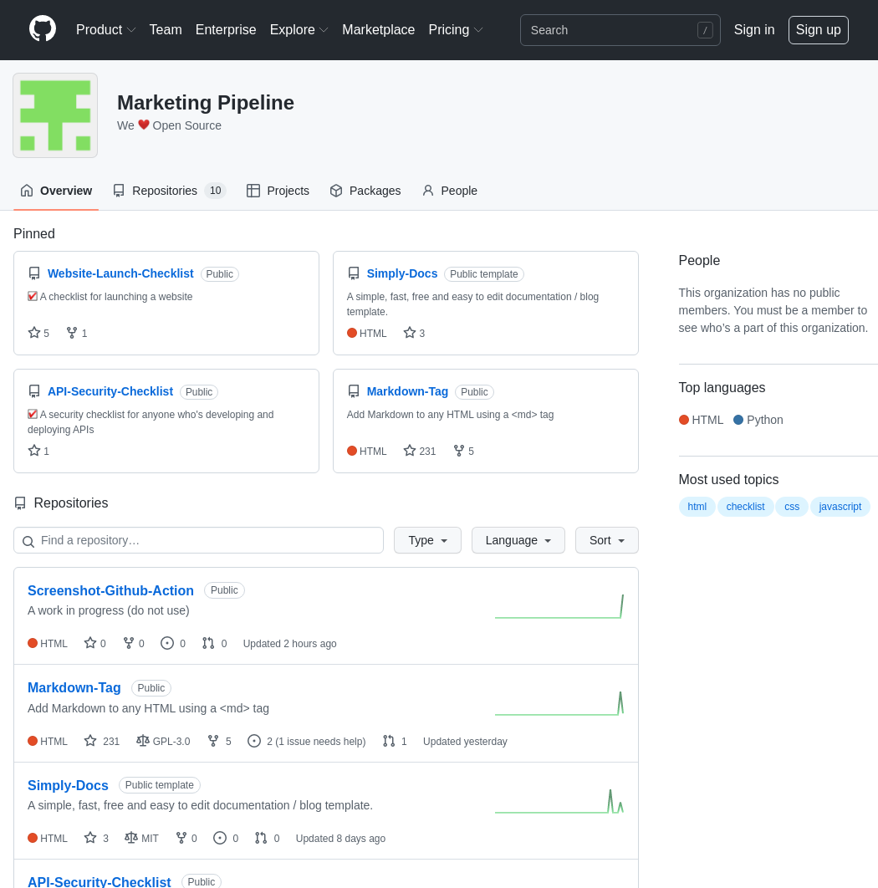

# Python-Selenium-Action

  

  
   
  
  

   
 
No need to struggle to figure out how to run a Python Selenium script with a GitHub Action. 
This is a ready to use template for running Selenium with Python via GitHub Actions either headless or non-headless.

## Example and usage

To use this on <b><i>Github</b></i>:

- Use this
[template](https://github.com/MarketingPipeline/Python-Selenium-Action/generate)

- Run the action "Run Selenium On GitHub Action" which will print GitHub site title. 

- Make changes as needed to the Python script <code>Selenium-Template.py</code>. 

- Delete the demo folder, and <code>demo.yaml</code> action

- If you change the name Selenium-Template.py - reflect the changes in your GitHub Action <code>yaml</code> file. 

 

#### Demo 

 

   This image was taken via a GitHub Action!
  

  

  
## Contributing 

Want to improve this? Create a pull request with detailed changes / improvements! If approved you will be added to the list of contributors of this awesome project!

See also the list of
[contributors](https://github.com/MarketingPipeline/Python-Selenium-Action/graphs/contributors) who
participate in this project.

## License 

This project is licensed under the MIT License - see the
[LICENSE.md](https://github.com/MarketingPipeline/Python-Selenium-Action/blob/main/LICENSE) file for
details.

